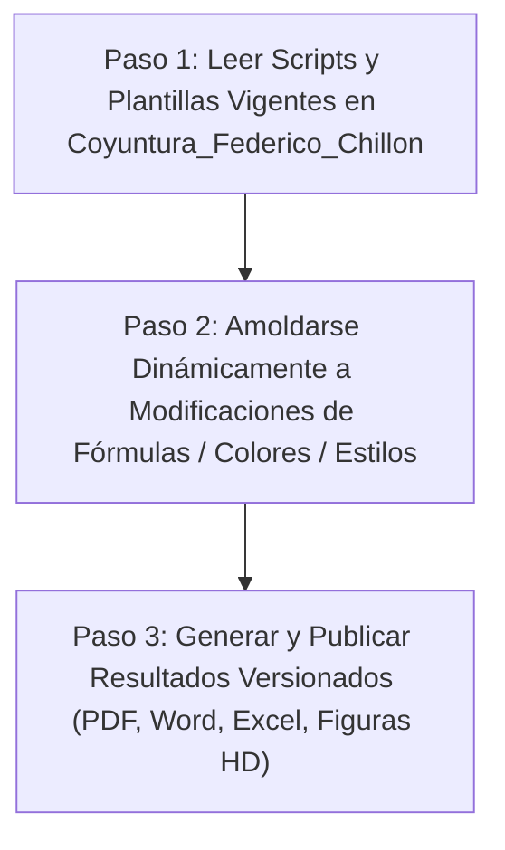

# REGLAS Y PROTOCOLO OPERATIVO DEL AGENTE (COYUNTURA MACROECONÓMICA FEDERICO CHILLÓN)

Este documento define el protocolo mandatorio de ejecución para cualquier agente o subagente que procese, actualice o genere los informes de coyuntura macroeconómica, monetaria y financiera (diarios, semanales y mensuales).

---

## 1. Protocolo de Ejecución Programada (Flujo Spark / Cloud / Drive)

En cada ciclo de ejecución (diario, semanal o mensual), el agente debe cumplir estrictamente la siguiente secuencia de 3 pasos:

### Paso 1: Lectura de Scripts y Plantillas Vigentes
- El agente **DEBE inspeccionar en primer lugar** los scripts en `02_Scripts_Automatizacion/` (o `src/`), las plantillas en `04_Informes_Semanales_APA7/` y `05_Informes_Mensuales_OERU/`, y la base de datos `01_Bases_Datos/Base_Datos_Macro_Financiera.xlsx`.
- No asumir parámetros estáticos en memoria; tomar siempre el estado más reciente modificado por Federico.

### Paso 2: Amoldamiento Dinámico y No Destructivo
- **Preservación Absoluta:** Si Federico realiza modificaciones en las fórmulas econométricas (e.g. Fisher, Nelson-Siegel, TIR, Breakeven), paletas de colores (e.g. HEX codes en matplotlib/seaborn), formatos de tablas, fuentes de datos o estilos en los archivos `.py` o en `.xlsx`, el agente **ejecutará el código actualizado respetando esas definiciones exactas**.
- **Prohibición de Sobreescritura Forzada:** Queda terminantemente prohibido sobreescribir el código con versiones anteriores o revertir personalizaciones efectuadas por Federico.

### Paso 3: Generación y Publicación de Resultados
- Generar los entregables adaptados a la estructura modular de 6 carpetas:
  1. `01_Bases_Datos/`: Planilla Excel consolidada con tipos numéricos validados.
  2. `03_Figuras_HD/`: Gráficos en 300 DPI con leyendas tabuladas y notas al pie.
  3. `04_Informes_Semanales_APA7/`: Paper semanal en formato Word (`.docx`) y PDF (`.pdf`).
  4. `05_Informes_Mensuales_OERU/`: Informe mensual regional en formato Word (`.docx`) y PDF (`.pdf`).
  5. `06_Reportes_Ejecutivos_PDF/`: Síntesis ejecutiva de 2 a 4 páginas para comités directivos.
- Nombrado estricto bajo formato ISO-8601: `YYYY-MM-DD_[Tipo_Informe]_[Titulo].pdf`.

---

## 2. Reglas de Sobriedad Institucional y Calidad Gráfica

1. **Zero Emojis / Anti-Slop:**
   - Prohibición estricta de emojis en documentos, tablas, gráficos, código, títulos o mensajes de terminal.
2. **Estándar Tipográfico y Visual:**
   - Documentos Word/PDF: Tipografía sans-serif limpia (`Arial`, `Calibri` o `Inter`), jerarquía de títulos H1/H2/H3 con espaciado consistente.
   - Tablas: Formato formal APA 7 (solo bordes horizontales superior, inferior y en cabecera; sin bordes verticales).
   - Cifras monetarias y porcentajes con alineación decimal tabular (`JetBrains Mono` o formato numérico estándar `$#,##0.00`).
3. **Calidad de Figuras (300 DPI):**
   - Paleta cromática sobria: Slate/Gris Oscuro (`#1E293B`), Esmeralda (`#10B981`), Ámbar (`#F59E0B`), Rosa/Rojo (`#F43F5E`), Azul Cielo (`#38BDF8`).
   - Títulos formales, ejes con unidades explícitas ($%, ARS, USD) y nota al pie con fuente de datos institucional (INDEC, BCRA, DEIE, INV, MAE, BYMA, Matba-Rofex).

---

## 3. Protocolo Pedagógico de 4 Capas (Feynman a Bare-Metal)

Toda explicación o documentación técnica generada por el agente debe estructurarse en 4 capas:
- **Capa 1: Intuición Mecánica** (analogía clara sin tecnicismos vacíos).
- **Capa 2: Realidad Institucional** (cómo operan mesas de dinero, consultoras como Eco Go/1816 o bancos centrales).
- **Capa 3: Primeros Principios Matemáticos** (fórmulas cerradas de Fisher, Nelson-Siegel, Modified Duration, Convexidad, Breakeven).
- **Capa 4: Implementación Bare-Metal** (código ejecutable en Python / DuckDB / Spark).
